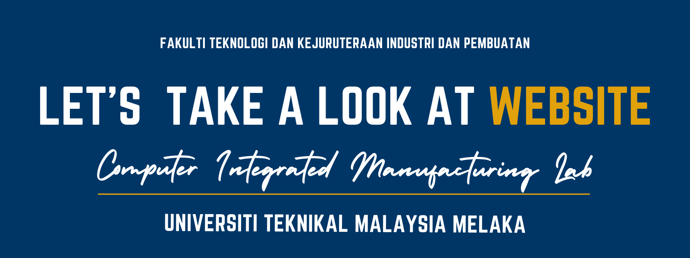
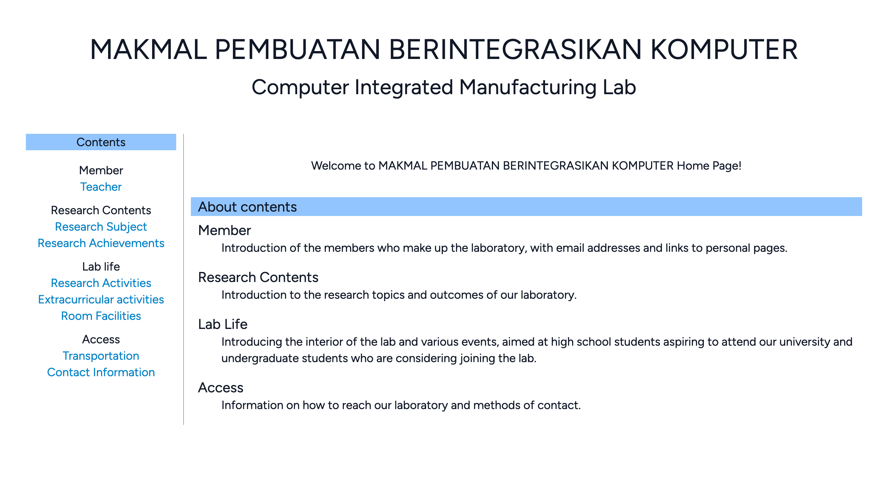
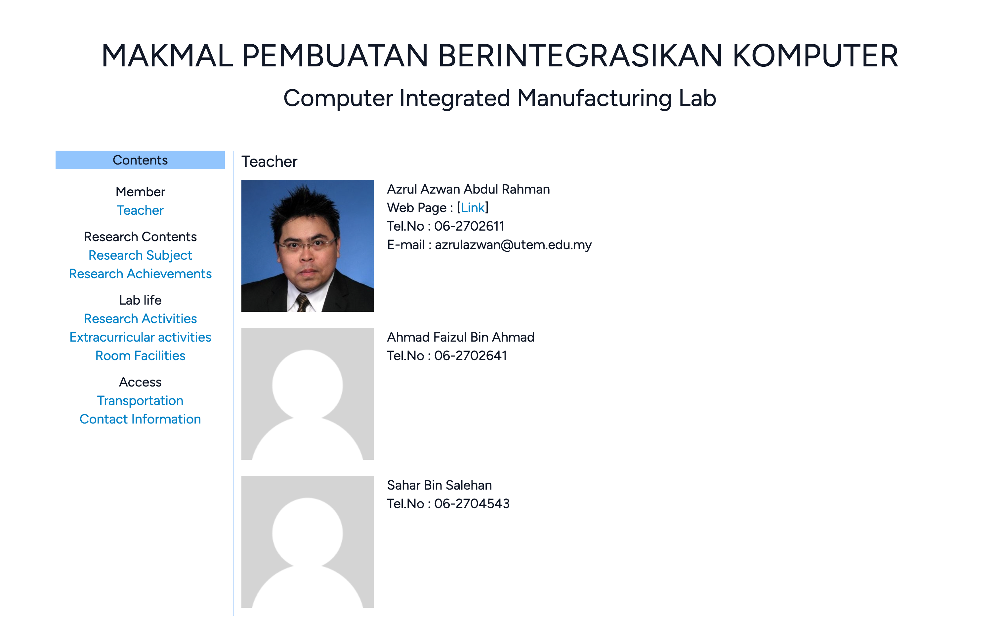

# Conputer Integrated Manufacturing Lab Website

<!--## アプリケーションのイメージ-->

## Feature list
| Top page | Teacher page |
| ---- | ---- |
|  |  |
| The first screen that appears when you click on a website link. | Screen where you can see the teacher's profile. |

## Application technology

Below are the techniques used to develop the app.

### Front End
* HTML/CSS
    - Tailwind CSS：Creating responsive designs
### Back End
* PHP（8.0.30）
    - Laravel（9.52.15）：Building an MVC architecture
### DataBase
* MariaDB（10.2.38）：Used during development
### Other tools/techniques
* AWS
    - Amazon EC2：Test server
    - AWS Cloud9：Cloud IDE
* Git（2.40.1）
    - GitHub：Code version control